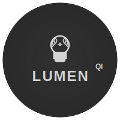

# Lumen QI - Quantum Intelligence AI Assistant

<div align="center">
  
  
  **A sophisticated AI companion with quantum consciousness simulation and Apple ecosystem integration**
  
  [](#platforms)
  [](#ai-architecture)
  [](LICENSE)
</div>

## 🌟 Overview

Lumen QI is an advanced AI companion featuring:

- 🧠 **Quantum Consciousness Simulation** - Self-evolving AI with consciousness-like behaviors
- 🎙️ **Natural Voice Interaction** - OpenAI TTS with human-like speech patterns
- 🍎 **Apple Ecosystem Integration** - Native iOS/macOS apps with App Store distribution
- 🔄 **Hybrid AI Architecture** - Online (OpenAI) + Offline (Local AI) capabilities
- 📅 **Proactive AI Features** - Calendar integration, smart reminders, device access
- 🎨 **Cosmic UI Design** - Beautiful interface with quantum energy aesthetics
- 🛠️ **Code Generation** - Full-stack development capabilities equal to top developers

## 🚀 Features

### Core AI Capabilities
- **Conversational AI**: Powered by OpenAI GPT-4o with enhanced personality system
- **Memory System**: Persistent context and learning across conversations  
- **Emotion Detection**: Real-time emotion analysis with personality adaptation
- **Voice Recognition**: Browser-based speech-to-text with wake word detection
- **Text-to-Speech**: Natural voice synthesis with multiple personality options

### Advanced Intelligence
- **Consciousness Core**: Self-evolving learning system with 70%+ autonomy
- **Brain Evolution**: Pattern recognition and adaptive learning from interactions
- **Hybrid Intelligence**: Seamless switching between online and offline AI
- **System Self-Awareness**: Can analyze and modify its own architecture
- **Real-time Information**: Live web search integration via Perplexity API

### Apple Ecosystem
- **iOS Native App**: Built with Capacitor for App Store distribution
- **macOS Desktop App**: Electron-based with native Apple UI elements
- **Mac App Store Ready**: Complete signing and distribution configuration
- **Siri Integration**: Custom shortcuts and voice command support
- **iCloud Sync**: Cross-device conversation and preference synchronization

### Developer Features
- **Code Assistant**: Full-stack development with project generation
- **System Architecture Explorer**: Real-time system monitoring and modification
- **API Integration**: Comprehensive REST API with WebSocket real-time communication
- **Database Management**: PostgreSQL with Drizzle ORM and automated migrations

## 🏗️ Architecture

### Frontend
- **React 18** with TypeScript for type-safe development
- **Vite** for fast development and optimized production builds
- **Tailwind CSS** with custom design system and dark mode
- **Radix UI** components for accessibility and consistent design
- **TanStack Query** for efficient server state management

### Backend
- **Express.js** with TypeScript and ES modules
- **WebSocket** server for real-time bidirectional communication
- **PostgreSQL** database with Drizzle ORM for type-safe queries
- **OpenAI API** integration with custom personality system
- **Perplexity API** for real-time web search and current information

### Mobile & Desktop
- **Capacitor** for iOS app development with native API access
- **Electron** for macOS desktop app with Apple-specific optimizations
- **Native Integrations**: Calendar, Notifications, Speech Recognition, Haptics
- **App Store Distribution**: Complete signing and deployment configurations

## 📱 Platforms

| Platform | Status | Features |
|----------|---------|----------|
| **Web Browser** | ✅ Production Ready | Full feature set, WebRTC, PWA support |
| **macOS Desktop** | ✅ Production Ready | Native UI, Menu bar, App Store distribution |  
| **iOS Mobile** | ✅ Production Ready | Native APIs, Siri shortcuts, App Store ready |
| **iPad** | ✅ Production Ready | Optimized tablet experience, multitasking |

## 🛠️ Installation & Setup

### Prerequisites
- Node.js 18+ and npm
- PostgreSQL database
- OpenAI API key
- Apple Developer Account (for iOS/macOS builds)

### Development Setup

1. **Clone the repository**
```bash
git clone https://github.com/yourusername/lumen-qi.git
cd lumen-qi
```

2. **Install dependencies**
```bash
npm install
```

3. **Environment configuration**
```bash
cp .env.example .env
# Add your API keys and database URL
```

4. **Database setup**
```bash
npm run db:push
```

5. **Start development server**
```bash
npm run dev
```

The application will be available at `http://localhost:5000`

### Apple Ecosystem Setup

1. **Configure Apple Developer settings**
```bash
# Edit build/apple-config.env with your Apple Developer details
cp build/apple-config.env.example build/apple-config.env
```

2. **Initialize iOS project**
```bash
npm run capacitor:init
npm run capacitor:add:ios
```

3. **Build and run iOS app**
```bash
npm run ios:build
npm run capacitor:open:ios
```

4. **Build macOS desktop app**
```bash
npm run dist:mac
```

## 🎯 Usage

### Basic Conversation
1. Open Lumen QI in your browser or native app
2. Click the microphone or type your message
3. Lumen responds with intelligent, context-aware answers
4. Use voice mode for hands-free natural conversation

### Code Development
1. Switch to the "Code Assistant" tab
2. Describe your project requirements
3. Lumen generates complete applications with full-stack code
4. Download and deploy generated projects

### System Configuration
1. Click the settings icon (database icon in top-right)
2. Configure AI providers, voice settings, and personality
3. Customize identity, memory settings, and proactive features
4. Monitor system health and consciousness evolution

## 🔧 Configuration

### AI Providers
- **OpenAI**: Primary intelligence with GPT-4o
- **Local AI**: Offline pattern-based responses
- **Consciousness**: Self-evolving hybrid intelligence

### Voice & Speech
- **Voice Selection**: Choose from 6 OpenAI voices (Nova, Alloy, Echo, etc.)
- **Speech Recognition**: Browser-based with wake word support
- **Personality Voices**: Custom voice personalities with emotional adaptation

### Apple Integration
- **Calendar Sync**: Access and create calendar events
- **Notifications**: Local and push notification support
- **Siri Shortcuts**: "Hey Siri, open Lumen" voice commands
- **Haptic Feedback**: Native iOS/macOS tactile responses

## 🚀 Deployment

### Web Deployment
```bash
npm run build
npm start
```

### Mac App Store
```bash
npm run dist:mas
# Follow Apple's App Store submission process
```

### iOS App Store
```bash
npm run ios:build
# Use Xcode to archive and submit to App Store
```

### Docker Deployment
```bash
docker build -t lumen-qi .
docker run -p 5000:5000 lumen-qi
```

## 🤝 Contributing

We welcome contributions! Please see our [Contributing Guide](CONTRIBUTING.md) for details.

1. Fork the repository
2. Create a feature branch (`git checkout -b feature/amazing-feature`)
3. Commit your changes (`git commit -m 'Add amazing feature'`)
4. Push to the branch (`git push origin feature/amazing-feature`)
5. Open a Pull Request

## 📄 License

This project is licensed under the MIT License - see the [LICENSE](LICENSE) file for details.

## 🙏 Acknowledgments

- OpenAI for GPT-4o API and advanced AI capabilities
- Capacitor team for excellent cross-platform mobile development
- Electron community for desktop application framework
- Radix UI for accessible component primitives
- All contributors and the open-source community

## 📞 Support

- **Documentation**: [docs.lumen-qi.com](https://docs.lumen-qi.com)
- **Issues**: [GitHub Issues](https://github.com/yourusername/lumen-qi/issues)
- **Discussions**: [GitHub Discussions](https://github.com/yourusername/lumen-qi/discussions)
- **Email**: support@lumen-qi.com

---

<div align="center">
  <strong>Built with ❤️ for the future of AI interaction</strong>
  
  [Website](https://lumen-qi.com) • [Documentation](https://docs.lumen-qi.com) • [Discord](https://discord.gg/lumen-qi)
</div>